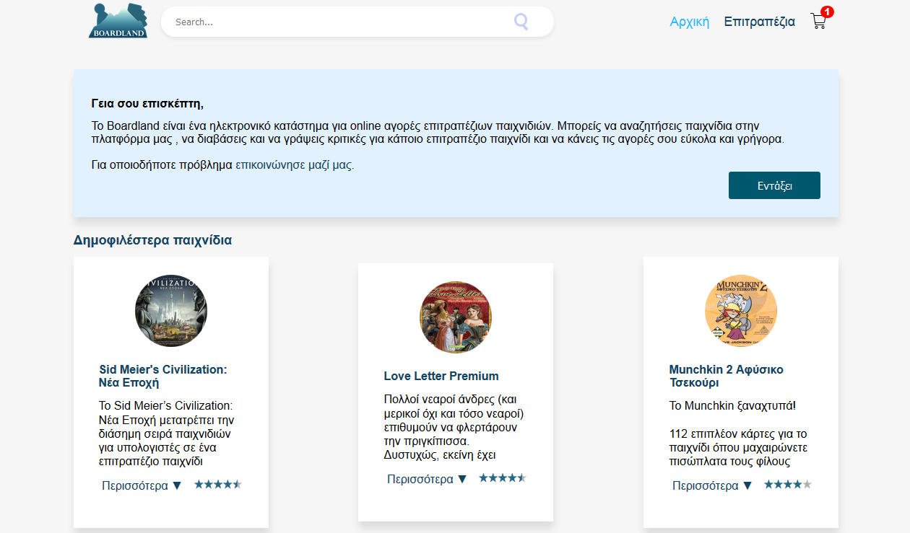
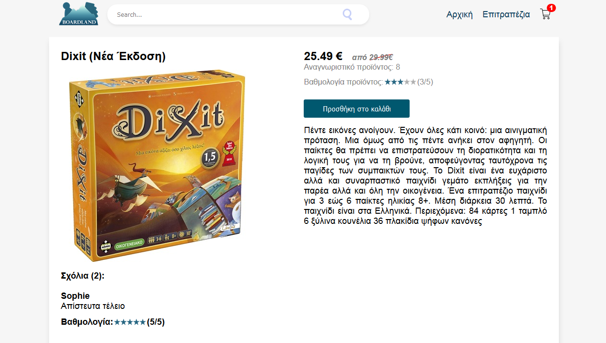
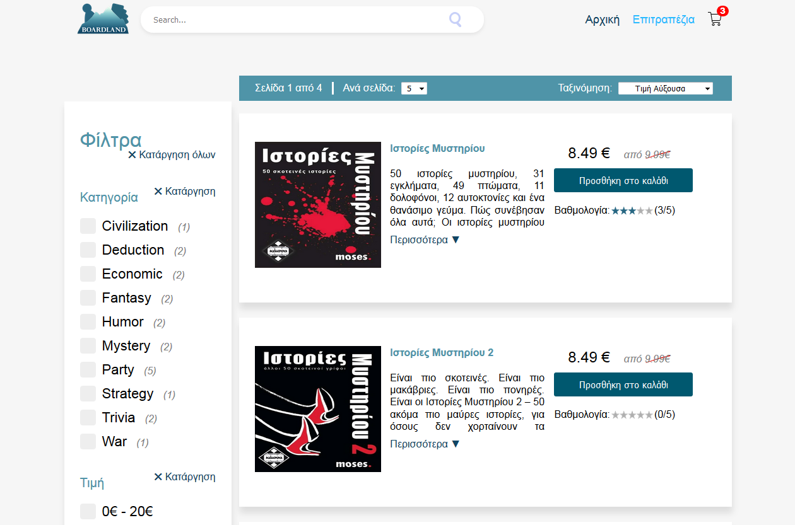
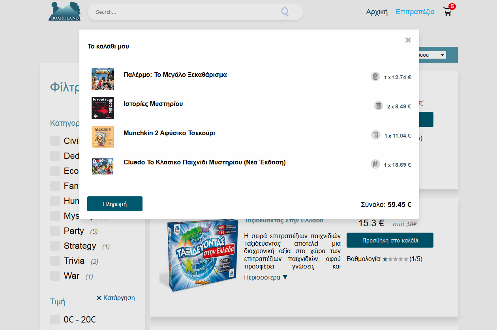

# Boardland

An online shop for board games, built from scratch using php, javascript, html, css, and mysql. 

### Demo

You can view a demo [**here**](http://timoleonl.webpages.auth.gr/Boardland/).
(This e-shop is not real. It was built for educational purposes)

### Developers

Τιμολέων Λατινόπουλος ([TimoleonLatinopoulos](https://github.com/TimoleonLatinopoulos))

Αθανάσιος Μπόλλας ([Thanasis1101](https://github.com/Thanasis1101))

Δημήτριος Σκουλής ([jimskoulis](https://github.com/jimskoulis))

Αναστάσιος Τεμπερεκίδης ([tasosxak](https://github.com/tasosxak))

### Screenshots

